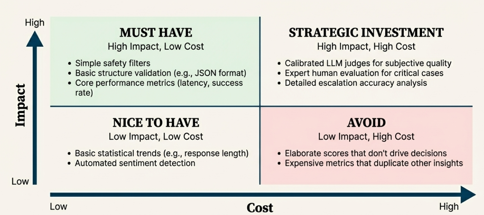
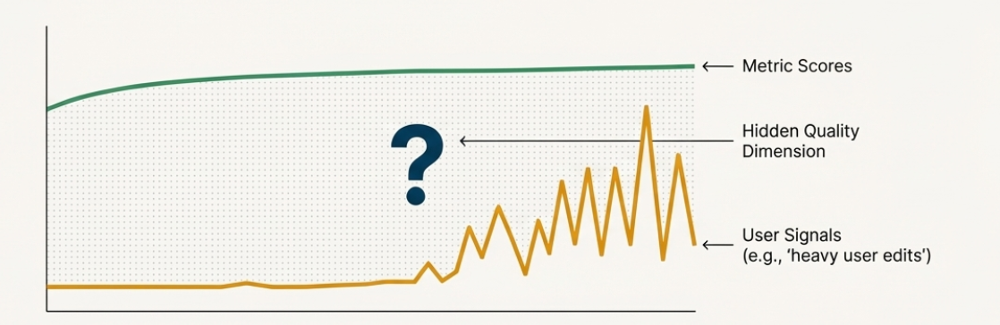

# Chapter 7: Production Monitoring Strategies
- Several approaches for log filtering exist
  - Priority-Based Filtering
    - High-priority: E.g. safety violations, system errors, high-value interactions
    - Medium-priority: Routine interactions that show unusual patterns (anomalies)
    - Low-priority: Simple, standard interactions
  - Signal-Based Sampling. Some examples:
    - Conversation patterns: unusual length, repetition, explicit escalation requests, confusion indicators
    - User behaviour patterns: extensive editing of generated code, retry behaviour, frustration indicators, abandonment patterns
    - Content quality indicators: response completeness, format consistency, context matching
  - Dynamic filtering based on production signals
    - Increase sampling in case of error rate spikes, increases in human support tickets, shifts in user behaviour patterns, marketing campaigns
    - Decrease sampling with stable performance metrics, mature interaction patterns
    - Good examples to track: support ticket volume / categories, user session abandonment rates, conversation length trends, business conversion rate
- The Metric Value Framework
  - Evaluate each metric across impact reliability, cost
    - Impact: How much does it help you improve the system?
    - Reliability: How accurate and consistent is this metric?
    - Cost: How much does it cost? (Detailed human checks are the most costly)
- Use a prioritization matrix:
  
- Online vs. Offline Evaluation: Guardrails vs. Improvement Flywheel
  - Online Evaluation: Business critical guardrails that prevent catastrophic outcomes in real-time
  - Offline Evaluation: Analyze trends to get better over time
- When online guardrails trigger, system must take immediate action such as handing off to a human, blocking harmful content, or escalating to specialists
- Critical guardrail examples:
  - Safety violations
  - Compliance failures
  - High-value customer situations
  - Big system failures
  - Critical business rule violations
- Guardrails need to work even when other parts of the system are stressed
- Examples of guardrail metrics:
  - Filters that block harmful content from reaching the user
  - Compliance checks that require disclaimers for financial advice
  - Uncertainty detection triggering human handoffs
  - High-value customer detection routing to premium support
- Offline evaluation: Improvement Flywheel. Examples:
  - LLM Judge assessment of conversation quality trends
  - Human expert review of escalated cases
  - Edge case evaluation
  - Assessment of guardrail effectiveness and calibration
- Emerging issues discovery: identifying mismatch between metrics and signals

- These mismatches merit a human review
- 
