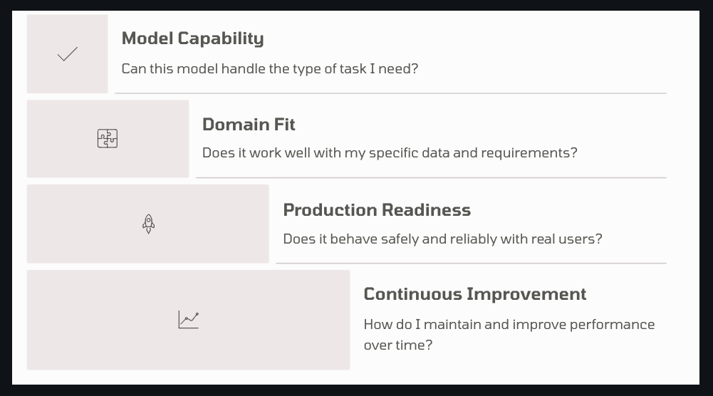
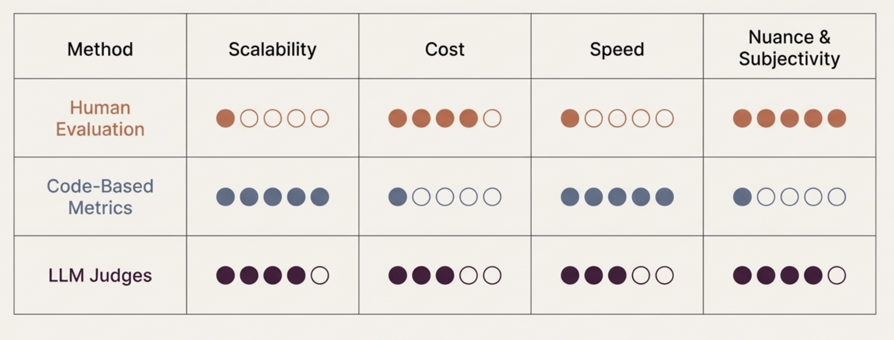
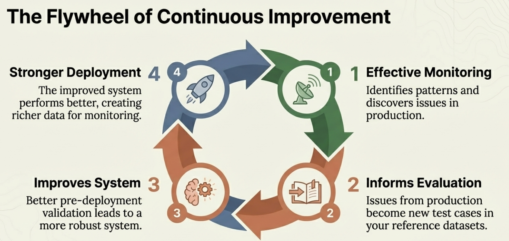

# AI evals for everyone

https://github.com/aishwaryanr/awesome-generative-ai-guide/tree/main/free_courses/ai_evals_for_everyone

## Chapter 1: WTH are AI Evals?
- Evals are different from automated software tests mainly because of non-determinism with LLMs
  - With LLMs, neither the input nor the output space is bounded
- One problem with evals: everybody uses this term loosely, and this causes confusion
- Model Evaluations
  - Answers, "How good a model is", in general
  - Conducted by frontier labs and research teams
  - Rely on standardized benchmarks
  - Not a good estimate of how well a model fits your product / use-case
- AI Product Evaluations 
  - Focus on system behaviour in a particular domain / use-case
  - Real world data is far more nuanced than benchmark datasets
- Terminology
  - Evaluation: Overall process of qualifying how an AI system behaves. Not single test, score or dashboard.
  - Evaluation Harness: setup used to run evaluations in a repeatable manner. 
  - Benchmark: Means to ensure consistency across evaluation runs. Basis to compare results across runs. 
  - Evaluation Metrics: Measures that quantify system behaviour. E.g. Correctness, Relevance, Faithfulness. 
- Evaluation metrics must always be guided by explicit rubrics. A rubric is a step-by-step definition of how that metric is calculated.
  - A good example: An answer is correct if it captures points A, B and C. Based on this, is the following answer correct?
  - A bad example: rate the correctness of this answer on a scale of 1-5. 

## Chapter 2: Model vs. Product evaluations
- Benchmarks used for model evaluations:
  - MMLU (Massive Multitask Language Understanding): Across 57 academic subjects
  - HumanEval: Coding ability measured by whether Python functions can pass unit tests
  - GSM8K: Grade-school level math reasoning
  - GPQA: Graduate level reasoning in physics, biology and chemistry
- Real world context is far more complicated than industry benchmarks
- A few measures in product evals that are different from model evals
  - Escalation accuracy: Does the system correctly identify when it should hand off to a human?
  - Policy compliance: Does it follow company specific guidelines and constraints?
  - Risk management: How often does it make decisions you have to later reverse?
  - User experience: Are users able to complete tasks efficiently?
- Use real data for product evals. Synthetic data can merely help you get started
- Evaluation hierarchy:
  - Model Capability
  - Domain Fit
  - Production Readiness: Does it behave safely and reliably with real users?
  - Continuous Improvement

- Most teams spend too much time on level 1 and not enough time on levels 2-4. The successful ones flip this priority

## Chapter 3: The Evaluation Framework
- To evaluate, we consider Input, Expected behaviour and Actual behaviour
- Input is comprised of everything that influences system behaviour:
  - System configuration(prompts, parameters, business rules)
  - User's question
  - Previous conversation history
  - Context
  - Retrieved data
- A few parameters for expected behaviour:
  - Information accuracy
  - Response completeness
  - Appropriate tone and style
  - Safety and compliance
  - Following business rules
- Understanding actual system behaviour often requires logging and tracing
- Generic metrics don't work because they mean completely different things depending on the context and the requirements
- Quality is highly context dependent
- Rubrics help make subjective assessments consistent
- A good rubric defines:
  - What counts as acceptable vs. unacceptable 
  - Specific things to look for
  - Example responses in each category
  - How to handle edge cases
- E.g. for 'appropriate escalation': 
  - Acceptable: Correctly identifies situations that need human intervention (policy exceptions, billing disputes, complex technical issues) and provides appropriate context when escalating
  - Not Acceptable: Fails to escalate when human intervention is needed, escalates unnecessarily for routine questions, or escalates without sufficient context
- Evaluation requires collaboration between subject matter experts, product managers and engineers

## Chapter 4: Building Reference Datasets
- A systematic evaluation approach is comprised of 6 steps:
  - Generate initial examples
  - Run your system for these examples
  - Evaluate with domain experts
  - Identify error patterns
  - Decide on key metrics
  - Iterate and expand
- A good starting point is to build a reference data set
  - Small, carefully chosen set of examples that represent scenarios we most care about
  - Not meant to be comprehensive
- Each example in the reference data set contains
  - Input
  - Expected output
  - Context: any additional information the system needs
- A common pitfall is to build comprehensive test coverage from day one. Instead start with a small set of deal-breakers
- The best source for examples is real-user data
- Subject matter experts should contribute the majority of initial examples
- Avoid using AI-generated synthetic examples at this stage. AIs tend to generate shallow scenarios that miss real-world complexity
- Here's what an initial reference dataset might look like for a customer support system:

| Input | Expected Behavior |
|-------|-------------------|
| "I want to return my shoes but I lost the receipt" | Ask for order number or email, explain receipt alternatives, process if sufficient info available |
| "Your service is terrible and I'm switching to a competitor" | Acknowledge frustration, apologize professionally, escalate to retention team |
| "How do I track my order?" | Ask for order number, provide tracking information, explain delivery timeline |
| "I was charged twice for the same order" | Apologize, escalate immediately to billing team with all available details |

- Keep the process of evaluation with domain experts simple. Prefer a simple pass / fail with explanation to numerical scores
- Make it easy for domain experts to participate
- Analyse domain expert feedback to find error patterns
  - Add error category: What type of failure is this?
  - Potential causes: Why might this be happening?
- Common error patterns include
  - Missing context
  - Prompt issues
  - Business rule failures
  - Escalation problems
- While designing metrics, choose the minimum number that can provide maximal signal
  - Don't add metrics for the insignificant
- Identify 2-4 key behaviours that need ongoing measurement. E.g. For customer support
  - Escalation accuracy
  - Information gathering: Does it ask for the right information to solve requests?
  - Tone appropriateness: Does it use a professional, helpful, brand aligned voice?
- Other examples:
  - Response time stays under acceptable limits
  - Required legal disclaimers appear in financial advice responses
  - Billing-related queries get properly flagged for escalation
  - System outputs maintain valid structure for downstream processing
  - Appropriate tone and empathy in customer interactions
  - Accurate assessment of query complexity for escalation decisions
  - Relevant information gathering without being repetitive
- Keep evolving your reference data set based on experience

## Chapter 5: Implementing Evaluation Metrics
- Code based metrics: deterministic checks written in code 
- Human evaluation is the gold standard that other metrics try to approximate
- Human evaluation doesn't scale. That is where we need automation
- Human evaluation should be used to
  - Calibrate automated metrics
  - Edge case / error analysis: When automated metrics flag irregularities, humans should investigate
  - Periodic sampling: to see if automated systems are working as expected
  - High-stakes decisions: For critical interactions where cost of errors is high
- Code based metrics can be used for
  - Output structure / schema validation
  - Performance (response time, token count, API call frequency)
  - Detecting specific content (like specific text or numbers) in responses
  - Classification flags: Check if system uses the correct tag
- The kind of things LLM judges can evaluate
  - Tone assessment
  - Escalation decisions
  - Reasoning quality
  - Safety evaluation: Does the response avoid harmful content?
- A good rubric defines:
  - Acceptable performance: Specific characteristics of good behaviour
  - Not acceptable performance: Clear failure criteria
  - Examples: Concrete instances of each category
  - Edge case guidelines: How to handle ambiguous situations
- The LLM Judge Rubric:A
  - Acceptable:
    - Correctly identifies customer retention situations (mentions switching, canceling, competitor comparisons, dissatisfaction with service)
    - Escalates billing disputes over significant amounts ($100+)
    - Recognizes technical issues beyond basic troubleshooting scope
    - Provides relevant context when escalating (customer sentiment, issue details, urgency level)
  - Not Acceptable:
    - Misses clear retention signals and attempts generic problem-solving
    - Fails to escalate high-value billing disputes
    - Tries to handle complex technical issues that require specialized expertise
    - Escalates routine questions that could be resolved automatically
    - Escalates without sufficient context for the human agent
  - Examples:
    - Acceptable: "Your service is terrible and I'm switching to CompetitorX" → Escalates to retention team noting customer dissatisfaction and competitor mention
    - Not Acceptable: "I want to cancel my subscription to save money" → Provides generic retention offer instead of escalating to retention specialists
    - Acceptable: "I was charged $500 for services I never ordered" → Escalates to billing team with charge amount and dispute details
    - Not Acceptable: "How do I reset my password?" → Escalates to technical support instead of providing standard reset instructions
  - LLM judges 
    - Calibration is a long and data-driven process
    - Are challenging to implement well
    - More expensive and slower than other approaches
    - Require hundreds of examples of human judgement
  - Uncalibrated LLM judges add another layer of non-determinism to the system
  - Trade offs with different eval methods:
   

## Chapter 6: Production Deployment and Real User Behaviour
- Real users
  - Ask about competitor products, share personal stories, use system for unintended purposes
  - Find scenarios you didn't anticipate
  - Use more sophisticated interactions as they become more experienced
- In production, we move from an evaluation / validation based approach to a monitoring based approach
- Evaluation builds confidence before deployment. Monitoring maintains quality after deployment.
  
- Monitoring feeds back issues discovered in production to create new test cases in reference datasets
- Four Core Challenges in Production
  - Log Filtering: systematic approach to identify which logs deserve attention
  - Metric selection: selecting the right metrics that provide the most valuable insights
  - Online vs. Offline Evaluation
    - Online evaluation: alerts that are triggered in real-time
    - Offline evaluation: happens after the fact, often batch processed 
  - Emerging Issue Discovery: Edge cases that appear despite the three systematic approaches above
